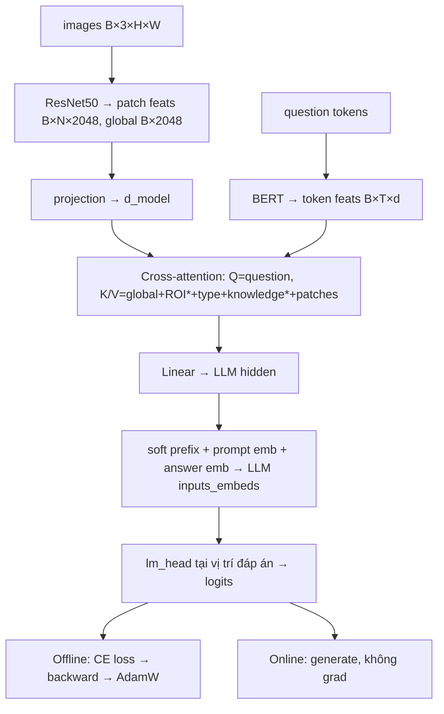

# Computational graph

```mermaid
flowchart TD
    A[images B×3×H×W] --> B[ResNet50 → patch feats B×N×2048, global B×2048]
    B --> C[projection → d_model]
    Q[question tokens] --> D[BERT → token feats B×T×d]
    C --> F[Cross-attention: Q=question, K/V=global+ROI*+type+knowledge*+patches]
    D --> F
    F --> G[Linear → LLM hidden]
    G --> H[soft prefix + prompt emb + answer emb → LLM inputs_embeds]
    H --> I[lm_head tại vị trí đáp án → logits]
    I --> J[Offline: CE loss → backward → AdamW]
    I --> K[Online: generate, không grad]
```
`*` modality thiếu thì bị mask, không bịa. Model ngoài mặc định đóng băng; chỉ projection, fusion và projection vào LLM được train.
