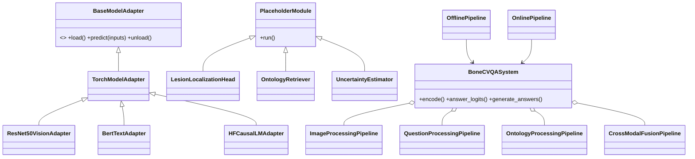

# UML

```mermaid
classDiagram
    class BaseModelAdapter{<<abstract>> +load() +predict(inputs) +unload()}
    class TorchModelAdapter
    class ResNet50VisionAdapter
    class BertTextAdapter
    class HFCausalLMAdapter
    BaseModelAdapter <|-- TorchModelAdapter
    TorchModelAdapter <|-- ResNet50VisionAdapter
    TorchModelAdapter <|-- BertTextAdapter
    TorchModelAdapter <|-- HFCausalLMAdapter
    class PlaceholderModule{+run()}
    PlaceholderModule <|-- LesionLocalizationHead
    PlaceholderModule <|-- OntologyRetriever
    PlaceholderModule <|-- UncertaintyEstimator
    class BoneCVQASystem{+encode() +answer_logits() +generate_answers()}
    BoneCVQASystem o-- ImageProcessingPipeline
    BoneCVQASystem o-- QuestionProcessingPipeline
    BoneCVQASystem o-- OntologyProcessingPipeline
    BoneCVQASystem o-- CrossModalFusionPipeline
    class OfflinePipeline
    class OnlinePipeline
    OfflinePipeline --> BoneCVQASystem
    OnlinePipeline --> BoneCVQASystem
```
